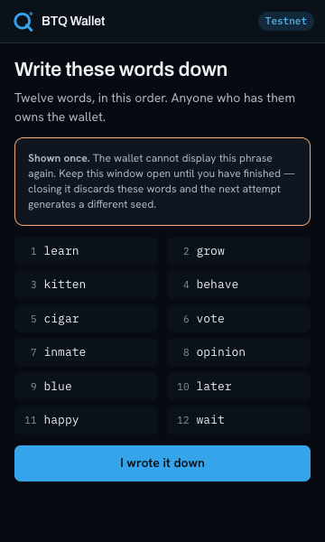
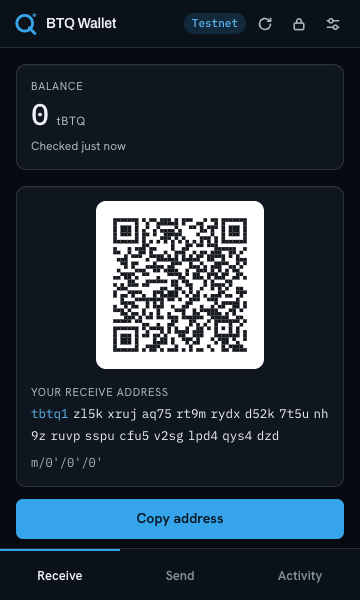
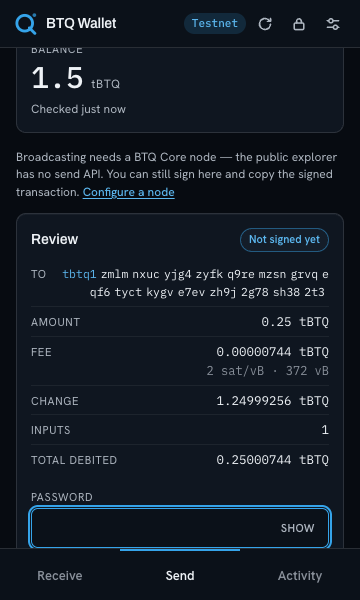
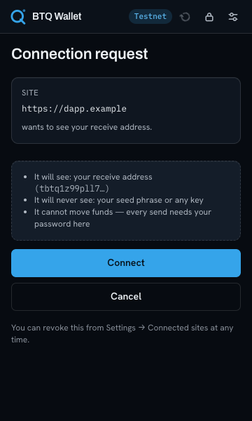

# BTQ Browser Wallet

A Chrome (MV3) extension wallet for **Bitcoin Quantum testnet** — post-quantum ML-DSA-44
keys, P2MR (witness v2) addresses, `tbtq1z…`. The seed is generated, sealed and used only
inside the extension's service worker; balances and history come from the public explorer,
and every transaction is built and signed locally before anything touches the network.

Five-minute path: [load the extension](#load-the-extension) → [try the flows](#try-the-flows)
→ [run the tests](#run-the-tests). If you only read one caveat, read
[Broadcast: the truth](#broadcast-the-truth).

## Screenshots

| | |
|---|---|
|  |  |
| **Create** — the phrase is shown once and never written to storage. | **Receive** — next unused address, its path, QR, copy. |
|  |  |
| **Send** — the review card replaces the form, so what you read is what gets signed. | **Site-connect** — exact origin, revocable, and it can never move funds. |

Dark theme shown; the popup follows the OS light/dark setting. The recovery phrase above
belongs to a throwaway wallet made for the screenshot.

## Load the extension

Requires **Node 20.19+ (or 22.12+)** — Vite 7 and the Playwright runner both need it.

```sh
npm install
npm run build      # → dist/
```

1. Open `chrome://extensions`.
2. Turn on **Developer mode** (top right).
3. **Load unpacked** → select the `dist/` directory this build just produced.
4. Pin **BTQ Wallet** and click the icon.

Chrome 116 or newer (the provider is injected into the MAIN world, which is Chrome 111+).

## Try the flows

**Create.** *Create a wallet* → set a password (≥8 characters) → the 12 words appear, once
→ confirm three of them. The vault is sealed with PBKDF2-SHA256 (600 000 iterations) and
AES-256-GCM before anything is persisted; the phrase is never stored.

**Import — both forms.** *I already have a seed* offers two:

- a **BIP39 phrase** (12 or 24 words, checksum validated) — the same mapping this wallet
  uses when it creates one;
- a **raw 32-byte HD seed** (64 hex characters) — btq-core's `sethdseed` shape.

They are different wallets from different inputs, not two spellings of one. See
[`docs/HD_IMPORT.md`](docs/HD_IMPORT.md) for why BTQ has no published HD standard and what
this wallet does about it.

**Receive.** The *Receive* tab shows the next unused external address (`tbtq1z…`), its
derivation path, a QR of exactly that string, and Copy. Balance is the sum of the
**unspent outputs** of every derived address — not the explorer's `balance` field, which
goes negative on busy addresses. A restore runs a 20-address gap scan on both chains, so a
wallet funded at index 7 comes back with its coins.

**Send.** *Send* → paste a `tbtq1z…` address, enter an amount in tBTQ (or press **Max**),
pick a fee (Economy 1 / Normal 2 / Priority 5 sat/vB) → **Review**. The review card
replaces the form and restates destination, amount, fee (tBTQ, sat/vB and vB), change,
input count and total debited. Enter the password → **Sign**. Mainnet `qbtc…`, legacy
base58 Dilithium (`n…`) and anything that fails its checksum are refused with a reason
before signing, as are amounts below the 270-sat dust floor. The numbers in the result are
decoded back out of the signed bytes, not carried over from the form.

**Site-connect.** Serve the demo page over HTTP (content scripts do not run on `file://`):

```sh
python3 -m http.server 8080 -d examples    # → http://localhost:8080/dapp.html
```

*Connect* calls `window.btq.request({ method: 'btq_requestAccounts' })`. The extension
opens an approval window naming the exact origin; the page's promise stays unsettled until
you answer. Approve and it gets one address; **Cancel**, close the window, or wait five
minutes and it gets `USER_REJECTED` (EIP-1193 code `4001`). *Disconnect* — or Settings →
Connected sites → **Revoke** — takes it back and fires `accountsChanged([])`. A page can
never call `wallet.*`: send, unlock and export are not on the relay's allowlist.

**Settings** (the sliders icon in the header). Explorer URL, an optional BTQ Core JSON-RPC
(URL, user, password), **Test connection** — which reports the explorer tip, the node's
chain and height, and warns if the node is behind or on a different chain — Connected
sites with revoke, a full rescan, lock now, and a typed-confirmation wipe.

## Broadcast: the truth

**The public explorer has no broadcast route.** `POST /api/v1/tx/send` answers
`404 Route POST:/api/v1/tx/send not found`; a `GET` returns 400 only because it collides
with `/api/v1/tx/:txid`, and the api-docs page lists no push path. Anyone who tells you
otherwise (including earlier drafts of these docs) probed the GET and stopped there.

So broadcasting goes through a node's JSON-RPC — `testmempoolaccept` then
`sendrawtransaction` — configured under Settings. Two things matter:

- Build it from the **`v0.5.0-testnet`** tag. The explorer's chain diverged from the older
  testnet between heights 299000 and 300000; a node on the old fork will happily accept
  your transaction into a chain nobody is watching.
- Check it is on the same chain: compare `getblockchaininfo.blocks` with
  `https://explorer.bitcoinquantum.com/api/v1/blocks/tip`. **Test connection** does this
  for you and refuses a node whose block hash at the explorer's tip height disagrees.

Without a node the wallet still **signs**, and says so. The transaction is signed *before*
any network call, so a broadcast failure never costs you the bytes: the result card shows
the node's rejection reason verbatim, keeps the signed hex with a copy button, and the
Activity row is marked **Not broadcast** so it is never mistaken for money in flight. Push
the hex yourself with `btq-cli sendrawtransaction <hex>` whenever you have a node.

## Run the tests

```sh
npm test            # 311 tests: unit, security, golden vectors — no node, no network
npm run typecheck   # src (browser-only types) and tests/tooling (node types) separately
npm run lint
npm run check       # all three
```

End to end, in a real browser:

```sh
npm run playwright:install   # once: fetches the Chromium build Playwright drives
npm run test:e2e             # builds dist/, loads it in Chromium, 18 tests (~25 s)
npm run test:all             # the above, after npm test
SKIP_BUILD=1 npm run test:e2e    # reuse the current dist/ while iterating
```

Nothing in the extension is stubbed there: the real service worker, the real popup, the
real content relay and the real MAIN-world provider run from `dist/`. The explorer and the
BTQ Core JSON-RPC are a deterministic mock on `127.0.0.1` whose node re-derives the BIP341
sighash and verifies the ML-DSA-44 signature itself, so a wallet that signed the wrong
message would still fail. Chromium is launched with DNS blackholed except loopback, so a
stray call to the live explorer fails instead of making the run non-deterministic.

Two opt-in tiers need a real `btqd` and are gated on `BTQ_REGTEST=1`:

```sh
BTQ_REGTEST=1 npx vitest run tests/integration                 # consensus cross-check
BTQ_REGTEST=1 npm run test:e2e -- tests/e2e/regtest.spec.ts    # the same, through the UI
```

Without the variable the Vitest tier is skipped and the Playwright tier skips itself. With
it set and no node listening they *fail* rather than skip — deliberately, since an opt-in
cross-check that silently passes is worthless. Connection settings come from
`BTQ_RPC_URL`, `BTQ_RPC_USER`, `BTQ_RPC_PASS`, `BTQ_RPC_WALLET`, defaulting to the node
below (`tests/integration/rpc.ts`):

```sh
mkdir -p /tmp/btq-m0-regtest
cat > /tmp/btq-m0-regtest/btq.conf <<'CONF'
regtest=1
server=1
fallbackfee=0.0002
[regtest]
rpcuser=m0
rpcpassword=m0pass
rpcport=18999
CONF
/path/to/btq-core/src/btqd -datadir=/tmp/btq-m0-regtest -daemon
/path/to/btq-core/src/btq-cli -datadir=/tmp/btq-m0-regtest -rpcport=18999 \
  -rpcuser=m0 -rpcpassword=m0pass createwallet m0d
```

### What each layer proves

| Layer | Runs | Proves |
|---|---|---|
| `tests/unit/` | always | Derivation, P2MR scripts, bech32m, BIP341 sighash (a frozen digest plus nine mutations), scale-16 weight/vsize/fee/dust, the explorer parsers against recorded live bodies, and a real on-chain transaction rebuilt byte-for-byte |
| `tests/vectors/` | always | `golden.json`, the frozen contract with consensus — addresses, scripts and tapleaf hashes cannot drift unnoticed |
| `tests/security/` | always | The paths that leak secrets or move funds: the vault ciphertext holds no seed, a wrong password (with back-off) opens nothing, a locked wallet cannot sign, derive or export, a page cannot reach `wallet.*` or storage, a foreign leaf script is refused, a hostile explorer cannot inject an amount or a script into the signing path, plus the connect state machine and the RPC contract |
| `tests/e2e/` | `npm run test:e2e` | The extension as shipped: create → receive → lock/unlock → fund → node → send → restore on a second profile, site-connect approve/scope/revoke, and the negative cases — wrong password, refused destinations, a broken explorer, a node that rejects. The mock node re-verifies the signature and the sighash independently |
| `tests/integration/` | `BTQ_REGTEST=1` | btq-core itself: the node echoes our address, `scriptPubKey` and merkle root byte-for-byte, and `testmempoolaccept` accepts a transaction we signed (its real interpreter ran `OP_CHECKSIGDILITHIUM`) and rejects one signed over a tampered digest |

[`tests/e2e/README.md`](tests/e2e/README.md) says exactly what is mocked, what each hostile
case would otherwise miss, and the one thing the suite asserts *is* stored in the clear.
[`.github/workflows/ci.yml`](.github/workflows/ci.yml) runs all of it on every push.

## Video

[`demo/btq-wallet-demo.mp4`](demo/btq-wallet-demo.mp4) is the end-to-end suite recording
itself — the real popup, driven by the tests, nothing staged. Regenerate it with:

```sh
npm run demo:video     # RECORD_VIDEO=1 playwright test tests/e2e/smoke.spec.ts, then
                       # scripts/stitch-demo.sh concatenates the clips (needs ffmpeg)
```

It is silent and popup-only by design. For a narrated walkthrough that also shows the
browser chrome and the dapp page, [`docs/VIDEO.md`](docs/VIDEO.md) is a shot list with
timings and what to say.

## Protocol notes

- **Addresses** are bech32m witness v2 — `tbtq1z…` on testnet. The witness program *is* a
  TapLeaf merkle root; there is no key path, so every spend reveals
  `<1312-byte ML-DSA pubkey> OP_CHECKSIGDILITHIUM` plus a `0xc1` control block.
- **Signatures** are exactly 2421 bytes (2420 + a mandatory `SIGHASH_ALL` byte), signed
  deterministically with an empty FIPS 204 context. `SIGHASH_DEFAULT` is rejected by
  consensus.
- **Fees** use witness scale factor **16**, not 4: one P2MR input is 4402 WU = 275.125 vB,
  and `MAX_STANDARD_TX_WEIGHT` caps a transaction at ~90 inputs.
- **Dust** for a P2MR output is **270 sats** (a 43-byte output plus a 47-byte spend
  estimate × 3000 sat/kvB) — the node's own rule, not a stricter guess.
- **Derivation** is hardened-only over the 32-byte ML-DSA seed — `m/0'/0'/n'` external,
  `m/0'/1'/n'` internal. There is no xpub and no watch-only derivation.

Every constant with its `btq-core` source line: [`docs/REFERENCE.md`](docs/REFERENCE.md).
The import-from-seed design, byte by byte: [`docs/HD_IMPORT.md`](docs/HD_IMPORT.md). The
95-row BTQ-vs-Bitcoin difference map: [`docs/BTQ_CORE_MAP.md`](docs/BTQ_CORE_MAP.md).

## Security model

Keys decrypt **only** inside the MV3 service worker, only while unlocked. The popup, the
content script and `window.btq` never receive the mnemonic, the HD seed or a secret key,
and `src/core/` is pure, browser-safe and dependency-light (`@noble/*`, `@scure/*`) so it
stays reviewable. [`SECURITY.md`](SECURITY.md) has the trust boundary, what the wallet
refuses, and what is deliberately out of scope.

## Layout

```
src/core/          pure protocol code — no I/O, no Buffer, no chrome.*, unit-tested
src/background/    MV3 service worker — vault, keyring, explorer, node RPC, connect broker
src/content/       isolated-world relay: allowlisted page methods, never key material
src/inpage/        window.btq provider (MAIN world, frozen surface)
src/ui/            React popup: components/ screens/ hooks/, one screen per file
examples/dapp.html a page that connects, reads accounts, disconnects, and probes for more
tests/unit/        crypto, derivation, script, address, fee, sighash, explorer parsers
tests/security/    secret leakage, locked wallet, bad seed, page RPC, connect lifecycle
tests/e2e/         the built extension in Chromium: journeys, connect, negatives, regtest
tests/integration/ cross-checks against a live btq-core node (opt-in)
tests/vectors/     golden.json — the frozen contract with consensus
scripts/           gen-vectors.ts · stitch-demo.sh
docs/              REFERENCE · HD_IMPORT · BTQ_CORE_MAP · PLAN · VIDEO · screenshots
demo/              btq-wallet-demo.mp4, recorded by npm run demo:video
.claude/           the skill and the security-review agent used to build this
```
