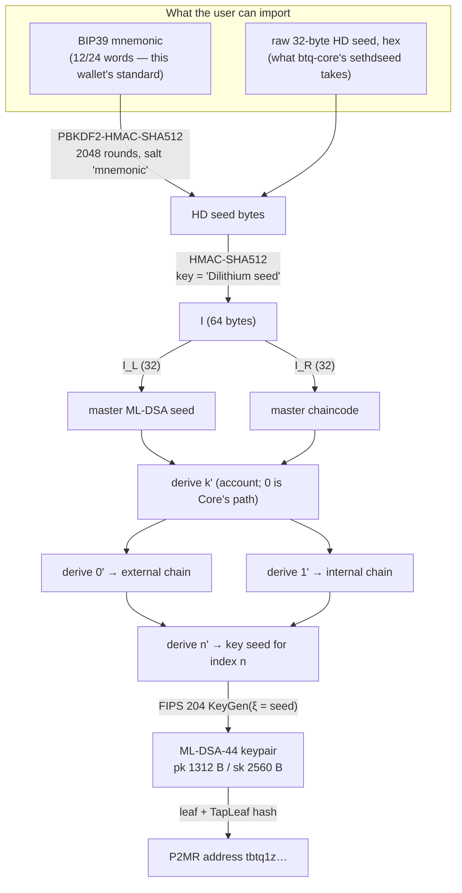
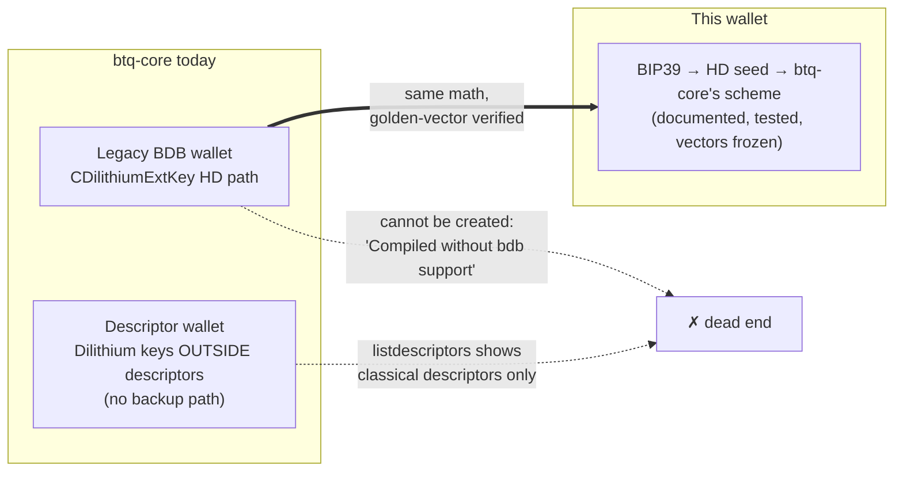
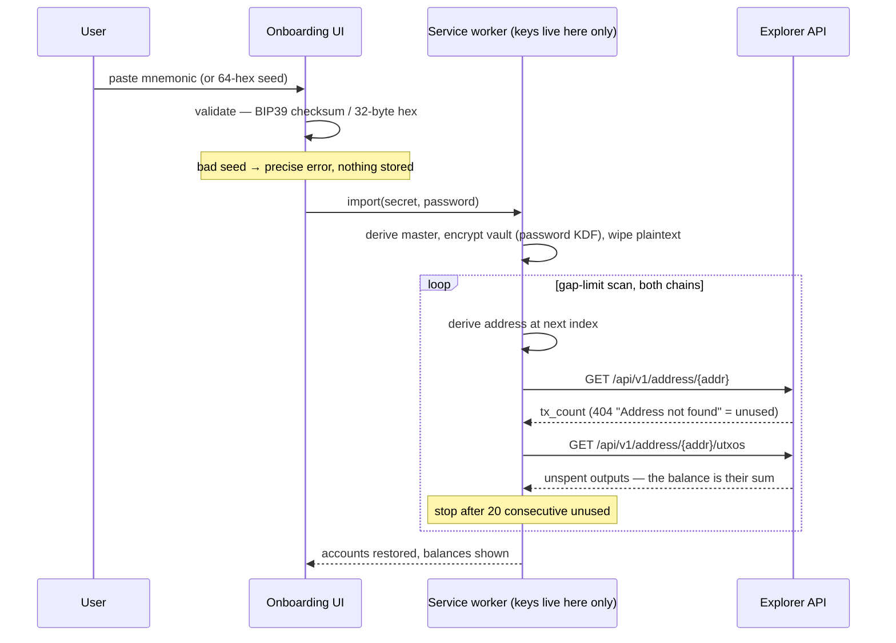

# Importing an HD wallet from the seed

A wallet has to let someone bring an HD wallet they already have, from the seed alone.
For BTQ that hides a real design problem, because BTQ has no published HD standard. This
document explains what btq-core actually does, what this wallet implements, and exactly
how the two meet — with the byte-level pipeline drawn out.

## Why this is not BIP32

ML-DSA (Dilithium) keys have no homomorphic structure: you cannot derive a child
*public* key from a parent public key the way secp256k1 allows. So there is no xpub, no
watch-only derivation, and every derivation step must start from secret material.
btq-core's answer (`src/crypto/dilithium_key.cpp`) is a BIP32-*shaped* scheme that walks
**32-byte ML-DSA seeds** instead of private scalars, and refuses non-hardened indices
outright.

## The derivation pipeline

Both wallet creation and import run the same pipeline; import simply starts from
material the user already has.



Each `derive` edge is one hardened step:

```
I = HMAC-SHA512( key = parent_chaincode,
                 msg = 0x00 ‖ parent_seed(32) ‖ ser32BE(index | 0x80000000) )
child_seed      = I[0..32]
child_chaincode = I[32..64]
```

— byte-for-byte btq-core's `CDilithiumExtKey::Derive`. The full path for the address at
index *n* is `m/k'/0'/n'` (receive) or `m/k'/1'/n'` (change). Account `k = 0`
is byte-for-byte `DeriveNewDilithiumChildKey` in
`src/wallet/scriptpubkeyman.cpp` — that is the golden-vector path. Extra
accounts in this wallet walk the same hardened split one level up
(`m/1'/…`, `m/2'/…`), the way MetaMask walks `m/44'/60'/k'`.

## Accounts above the first are this wallet's convention, not BTQ's

Say it plainly, because it is the one thing about this feature that can cost somebody
coins:

- **btq-core cannot derive them.** `src/wallet/scriptpubkeyman.cpp:1252` calls
  `DeriveDilithiumExtKey(masterKey, BIP32_HARDENED_KEY_LIMIT, accountKey)` — the account
  level is the hardcoded constant `0'`, there is no parameter and no RPC that moves it.
  A seed that restores this wallet in btq-core restores **account 1 only** (`m/0'/…`).
  Core's only other door for those coins is `importdilithiumkey`, one leaf key at a
  time, and this wallet has no key export.
- **The seed does not say how many accounts there were.** An account is a derivation
  path, not a record; nothing about `m/2'/…` is written into the phrase. A BIP39 phrase is
  an encoding of *entropy*: it says what the master secret is and nothing about what was
  done with it. There is no field to add, because there is no format to add one to.

So there are two restores, and only one of them carries the list.

1. **From a backup file** (`docs` below, and Settings → *Wallet backup file*). The account
   list travels sealed beside the seed, so the accounts come back with the names the user
   gave them and the restore asks the explorer nothing at all. This is the recommended
   path and the one the import screen names first.
2. **From the phrase alone**, which is exact and manual. Press *Add account* the same
   number of times, in order: `createAccount` always takes `max(index) + 1`, so the n-th
   press on a fresh restore is the same derivation path it was the first time and the same
   seed re-derives the same addresses. The coins reappear.
   `tests/security/scan-privacy.test.ts` asserts exactly this, addresses and balance both,
   because it is the whole argument for the paragraph below. Write down how many accounts
   you made — that number is the one piece of this wallet a phrase does not carry.

### The wallet does not go looking, and that is deliberate

An earlier build tried to recover the account *list* by scanning: a full rescan, and the
first scan after an import, probed two accounts past the highest one it knew and adopted
any whose external chain had been used. It was deleted, not put behind a flag.

- **It could not do what it promised.** Its own note said so: an account that never
  received coins leaves nothing on any chain to find. A feature that works only for the
  accounts you would have noticed anyway is not a recovery path.
- **The account list is metadata, not key material.** Recovering metadata by
  interrogating the chain is a category error. Key material is what the phrase is for;
  "how many accounts did I make" is a thing to back up, and the switcher now says so.
- **It paid for the attempt in disclosure.** ~20 addresses per guessed account, sent to
  one public explorer. Be precise about the harm: P2MR (BIP360) commits to a TapLeaf
  Merkle root, so the ML-DSA-44 public key stays hashed until the output is spent, and
  probing an address does **not** expose a public key to Shor-style key recovery. What it
  does is *link*: it hands one third party a batch of addresses that have no on-chain
  relationship, binding unused addresses of one wallet together in that explorer's logs
  before any of them is used, and the query pattern discloses the derivation structure —
  how many accounts exist, how far along each chain. While wallets hold both P2MR and
  legacy ECDSA outputs, that address graph is what tells an attacker which UTXOs are
  worth attacking.

Measured, on a four-account wallet with nothing to find: an idle refresh cost **168**
explorer requests before (160 gap lookups + 8 UTXO reads, 160 distinct addresses) and
**42** after; a full rescan **208** before and **168** after. The first scan after a
restore disclosed **40** addresses of accounts that had never been created; it now
discloses none. A routine refresh also stopped walking every account — it scans the
account on screen, the switcher refreshes the rest when it opens, and each row there
carries the age of the balance it is showing rather than passing an old number off as a
current one.

The alternative considered and rejected was recording the account count inside the
sealed vault payload. It cannot work for the case that matters: the payload on a fresh
device is written by that device's own import, out of the phrase the user just typed —
there is no older payload to read, so the number would always be 1 and would tell nobody
anything. It would only help a restore that copies the encrypted blob across.

That last sentence is the whole answer, once it is read the other way round. **A restore
that copies an encrypted blob across is exactly what a wallet file is**, and it is what
Sparrow and Electrum have done for years: the phrase is the key material, a wallet file is
everything else. The count could not ride in the vault payload because a fresh device
authors its own; it rides fine in a file that fresh device is *given*.

## The wallet backup file

`Settings → Wallet backup file`, behind the password, writes
`btq-wallet-backup-YYYY-MM-DD.btqbackup`. `Import → Use a backup file` reads one back onto
a device with no vault.

**One envelope, no new cryptography.** The file is `encryptVault`'s own output — `BTQ1`,
PBKDF2-SHA256 at 600 000 iterations, AES-256-GCM — over a plaintext that carries the HD
seed, the BIP39 entropy when there is one, and the account list. `src/core/vault/backup.ts`
adds a *schema*, not an algorithm, so the artefact is exactly as strong as the vault it
came from and there is no second thing to review.

It could not simply be the vault bytes already on disk, which would have been neater. The
vault payload holds key material only; the account list lives in `WalletMeta`, which is
rewritten every time an account is added, renamed or switched — none of which has the
password to hand. So `exportBackup` re-seals, once, at the moment the user asks.

**What travels: index and name, and nothing else.** No balance (stale the moment it is
written), no cursor (re-found in one scan), no cached address (derived). A backup that
carries a balance is a backup that lies about one.

**Same door as the reveals.** Unlocked or refuse; the password re-proved against the
sealed vault through `reauthPlaintext`, sharing the unlock back-off in both directions; a
wrong one names nothing but the password; refused to pages before the method name is even
read; both plaintexts wiped on the way out; and the sealed seed checked against the seed
the wallet is actually deriving from, so a swapped vault blob cannot make somebody save a
backup of a wallet that is not theirs.

**The import treats the file as hostile.** AES-GCM proves the bytes were sealed by whoever
knew that password — and on an import that may be whoever handed the file over. So
`decodeBackup` is as strict as `parseMeta`: bounded indices, no duplicates, account 0
required, hex checked, and every name through the same Cc/Cf/Zl/Zp strip the chrome relies
on. Authenticated is not trusted.

**What holding the file tells somebody.** It says a BTQ wallet exists — a blob whose first
four bytes are `BTQ1` is not mistakable for anything else, and that is stated beside the
button rather than glossed. It does **not** say how many accounts are in it: the plaintext
is padded to a fixed 8192 bytes, so every backup this build writes is the same size
whatever the list. The default name carries no address, no account name, no balance and no
network. With the password, of course, it is the whole wallet — which is the sentence the
export screen leads with.

Measured against the thing it replaces: restoring a four-account wallet from the file costs
**0** explorer requests, and brings back an account that never received a coin — the case
discovery admitted in its own note it could never find, at any depth.

## Where the standard actually lives (and doesn't)



btq-core's HD code path is real and tested, but unreachable in practice: modern builds
cannot create the legacy wallets that use it, and descriptor wallets give Dilithium keys
no derivation or backup story at all. So there is nothing interoperable to defer to —
whatever a browser wallet ships *becomes* its standard. We chose to:

1. **Reproduce btq-core's scheme exactly** (`src/core/crypto/hd.ts`) — it is the only
   precedent, and if BTQ ever revives it, wallets that followed it stay compatible.
   Golden vectors (`tests/vectors/golden.json`) pin every step; the regtest cross-check
   proved the node accepts what these keys sign.
2. **Front it with BIP39** — a mnemonic is what "give them a seed, show it once" means
   in practice, and the BIP39→seed step is itself standard. The mapping is exactly
   `mnemonic → BIP39 seed → HMAC-SHA512("Dilithium seed", seed) → …` with no extra
   passphrase mixing beyond BIP39's own optional passphrase.
3. **Also accept a raw 32-byte seed (hex)** — this is the shape btq-core's `sethdseed`
   consumes, so a user who holds a btq-core wallet seed can import it directly and get
   the same addresses a (legacy-capable) node would derive.

## What import does, step by step



The gap-limit scan (20, matching Bitcoin convention) is what makes import *restore* a
wallet rather than merely re-create key material: used addresses beyond index 0 are
found by asking the explorer, exactly the way the balance screen does, so an imported
wallet shows its history immediately. A lookup that fails is an error, never "unused" —
otherwise a flaky explorer would silently truncate the restore. That first scan covers the
active account and nothing else: it is no chattier than any later refresh, and it probes
for no account the user has not created.

## The failure modes we test

| Input | Behaviour |
|---|---|
| Mnemonic with a bad checksum | rejected before anything touches the vault |
| Word not in the BIP39 list | rejected, the offending word named |
| Hex seed that is not 64 hex chars | rejected |
| Valid but unused seed | imports cleanly, empty history, index 0 shown |
| Seed whose coins are on account 3 | the phrase alone restores Account 1; press *Add account* three times and account 3 comes back with its coins. No scan of any depth goes looking for it — the account list is metadata, and the request budget is pinned by `tests/security/scan-privacy.test.ts` |
| Seed whose account 3 was created but never funded | the same, and it is the case that decides the design: there is nothing on any chain for a scan to find, so only the user's own record — a backup file, or a note — can bring it back |
| Backup file plus its password | every account restored with its name and its derivation path, **zero** explorer requests to do it, and the account that was in front still in front |
| Backup file with the wrong password | `WRONG_PASSWORD`, worded as a password problem and never as a bad file |
| A file that is not a backup — a vault blob, a truncated copy, someone else's | `NOT_A_BACKUP`, one sentence, no field named. A vault blob is refused too: they share the envelope, and only the payload shape keeps them apart |
| Backup whose account name carries a bidi override or half a surrogate pair | stripped on the way in by the same filter the storage layer uses — a sealed file is authenticated input, not trusted input |
| Same seed imported twice | derives the identical addresses (golden-vector guarantee) |
| Mnemonic vs raw-seed of the same entropy | **different wallets** — BIP39 hashing sits between; the UI labels the two import modes explicitly to prevent confusion |
| Settings → Security on a raw-seed wallet | the phrase reveal is not rendered at all — a control that can only fail is worse than no control — and the HD seed reveal takes its place, with a sentence saying why. A phrase import seals its BIP39 entropy in the vault and can regenerate the words; a raw seed has none, and BIP39 hashing does not run backwards. Inventing words from the HD seed would hand the user a phrase that restores a *different* wallet — the seed hex they imported is the backup, and it goes back in through the same import screen |
