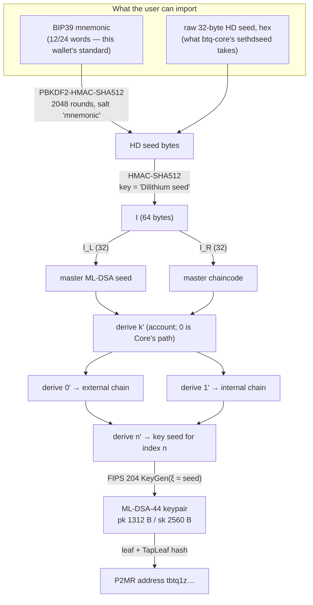
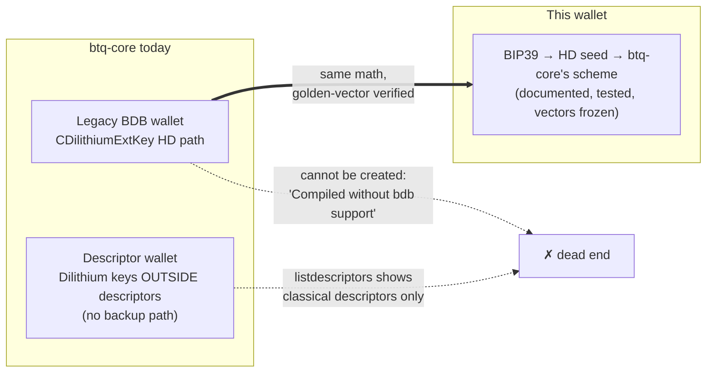
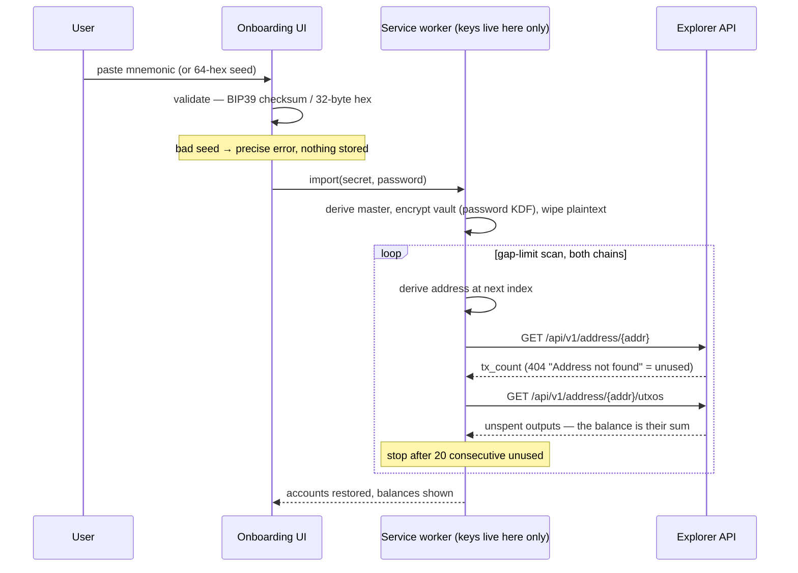

# Importing an HD wallet from the seed

A wallet has to let someone bring an HD wallet they already have, from the seed alone.
For BTQ that hides a real design problem, because BTQ has no published HD standard. This
document explains what btq-core actually does, what this wallet implements, and exactly
how the two meet — with the byte-level pipeline drawn out.

## Why this is not BIP32

ML-DSA (Dilithium) keys have no homomorphic structure: you cannot derive a child
*public* key from a parent public key the way secp256k1 allows. So there is no xpub, no
watch-only derivation, and every derivation step must start from secret material.
btq-core's answer (`src/crypto/dilithium_key.cpp`) is a BIP32-*shaped* scheme that walks
**32-byte ML-DSA seeds** instead of private scalars, and refuses non-hardened indices
outright.

## The derivation pipeline

Both wallet creation and import run the same pipeline; import simply starts from
material the user already has.



Each `derive` edge is one hardened step:

```
I = HMAC-SHA512( key = parent_chaincode,
                 msg = 0x00 ‖ parent_seed(32) ‖ ser32BE(index | 0x80000000) )
child_seed      = I[0..32]
child_chaincode = I[32..64]
```

— byte-for-byte btq-core's `CDilithiumExtKey::Derive`. The full path for the address at
index *n* is `m/k'/0'/n'` (receive) or `m/k'/1'/n'` (change). Account `k = 0`
is byte-for-byte `DeriveNewDilithiumChildKey` in
`src/wallet/scriptpubkeyman.cpp` — that is the golden-vector path. Extra
accounts in this wallet walk the same hardened split one level up
(`m/1'/…`, `m/2'/…`), the way MetaMask walks `m/44'/60'/k'`. btq-core has no
RPC for a second Dilithium account; these extra accounts are this wallet's,
restored by adding them again after an import (the gap scan covers one
account at a time).

## Where the standard actually lives (and doesn't)



btq-core's HD code path is real and tested, but unreachable in practice: modern builds
cannot create the legacy wallets that use it, and descriptor wallets give Dilithium keys
no derivation or backup story at all. So there is nothing interoperable to defer to —
whatever a browser wallet ships *becomes* its standard. We chose to:

1. **Reproduce btq-core's scheme exactly** (`src/core/crypto/hd.ts`) — it is the only
   precedent, and if BTQ ever revives it, wallets that followed it stay compatible.
   Golden vectors (`tests/vectors/golden.json`) pin every step; the regtest cross-check
   proved the node accepts what these keys sign.
2. **Front it with BIP39** — a mnemonic is what "give them a seed, show it once" means
   in practice, and the BIP39→seed step is itself standard. The mapping is exactly
   `mnemonic → BIP39 seed → HMAC-SHA512("Dilithium seed", seed) → …` with no extra
   passphrase mixing beyond BIP39's own optional passphrase.
3. **Also accept a raw 32-byte seed (hex)** — this is the shape btq-core's `sethdseed`
   consumes, so a user who holds a btq-core wallet seed can import it directly and get
   the same addresses a (legacy-capable) node would derive.

## What import does, step by step



The gap-limit scan (20, matching Bitcoin convention) is what makes import *restore* a
wallet rather than merely re-create key material: used addresses beyond index 0 are
found by asking the explorer, exactly the way the balance screen does, so an imported
wallet shows its history immediately. A lookup that fails is an error, never "unused" —
otherwise a flaky explorer would silently truncate the restore.

## The failure modes we test

| Input | Behaviour |
|---|---|
| Mnemonic with a bad checksum | rejected before anything touches the vault |
| Word not in the BIP39 list | rejected, the offending word named |
| Hex seed that is not 64 hex chars | rejected |
| Valid but unused seed | imports cleanly, empty history, index 0 shown |
| Same seed imported twice | derives the identical addresses (golden-vector guarantee) |
| Mnemonic vs raw-seed of the same entropy | **different wallets** — BIP39 hashing sits between; the UI labels the two import modes explicitly to prevent confusion |
| Settings → Security on a raw-seed wallet | the phrase reveal is not rendered at all — a control that can only fail is worse than no control — and the HD seed reveal takes its place, with a sentence saying why. A phrase import seals its BIP39 entropy in the vault and can regenerate the words; a raw seed has none, and BIP39 hashing does not run backwards. Inventing words from the HD seed would hand the user a phrase that restores a *different* wallet — the seed hex they imported is the backup, and it goes back in through the same import screen |
